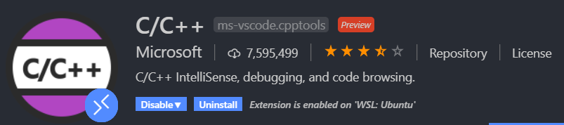
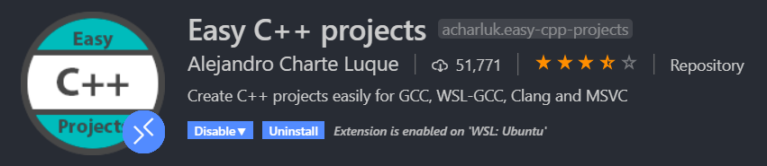

# SFML-Raycasting

## Dependencies
### For Ubuntu 18.04
    apt-get install build-essential
    apt-get install gdb # Optional: for debugging

### VSCode Extensions
It is recommended to use these extensions if you use VSCode.

## Preview
